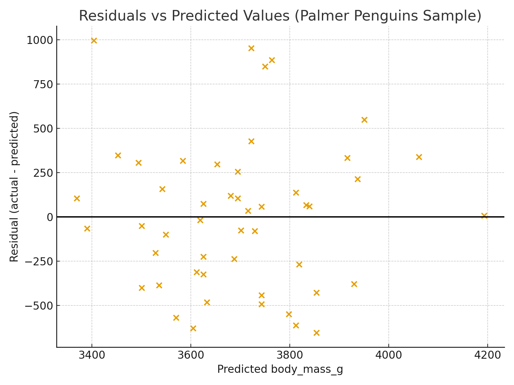

# Regression Diagnostics & Residual Interpretation  

When we fit a regression model, we draw a **best fit line** through the data.  
Every data point sits either above or below that line.

The **vertical distance** between a point and the best-fit line is called a **residual**.  
If you imagine a small **thread** hanging straight down from each point to the line:

- **Short thread = good fit** (the model predicted well)  
- **Long thread = poor fit** (the model predicted poorly)

Regression diagnostics are about looking at the **pattern** of all those threads at once.

---

## Task 1. Plot Residuals vs Fitted

A residual plot helps us see:

- whether the model works equally well across the range of predictions,  
- whether the relationship is actually straight (linear),  
- whether groups or patterns are hidden in the data,  
- and what steps might improve the model.

A **residual plot** places:

- **predicted values** on the x-axis  
- **residuals (vertical threads)** on the y-axis  

A good model produces a **random-looking scatter** with no shape when we plot **Residuals vs Fitted**.

If a shape appears, it gives us a clue about what to try next.

---

## Task 2. Look for Common Residual Patterns

These patterns show up frequently in real datasets.  
Each one suggests a specific type of model improvement.


### 2.1 Pattern 1: Curve (residuals bend)

**What it looks like:**  
Residuals bend upward or downward, forming a **curve**.

**What it means:**  
The underlying relationship is **not straight**.  
A straight-line model will miss this shape every time.

**Fixes to try:**  
- polynomial feature (e.g., x²)  
- log or square transformations  
- interaction terms  

**Example**  
UC-R Linear Regression Guide: Residuals vs Fitted 
- ISLR, Chapter 3
- <https://www.statlearning.com/>
- <https://rpubs.com/cheeloonglian/342680> 
- mpg vs horsepower
- The mpg vs horsepower **Residuals vs Fitted** plot shows curvature.

---

### 2.2 Pattern 2: Spread Fan/Funnel Shape (residuals spread out as predictions increase)

**What it looks like:**  
Residuals start close together and spread out like a **fan** or **funnel**.

**What it means:**  
When residuals form a **fan shape**, the model's errors get larger in certain ranges (often at higher predicted values).  
This means the variance is **not constant**, which violates an assumption of linear regression.

**Fixes to try:**  
- log-transform the target  
- log-transform a feature  
- square-root transform  
- polynomial terms if curvature is also present  

**Example**  
UC-R Linear Regression Guide: Residuals vs Fitted 
- <https://uc-r.github.io/linear_regression>
- The **Residuals vs Fitted** shows two things.

1. A very slight **curve** in blue LOESS curve which hints at mild nonlinearity
2. A very slight **fan/funnel shape** which hints at heteroscedasticity.

Neither pattern is strong, so the authors say:

- linearity is fair (because the LOESS line is mostly flat)  
- there is a slight funnel (because the spread of residuals increases a bit)

These are two different diagnostics:

  1. Interpreting the LOESS line (look for curvature)
    - If the LOESS curve **bends**, the relationship may not be linear.  
    - If the LOESS curve is **mostly flat**, linearity is acceptable.
  
  2. Interpreting the spread of points (look for uneven spread)
    - If residuals **spread out like a fan**, errors grow as values grow which indicates heteroscedasticity.  
    - If residuals are **evenly spread**, equal variance is acceptable.

---

### 2.3 Pattern 3: Clusters (residuals fall into groups)

**What it looks like:**  
Residuals form **bands** or **clusters**, often corresponding to categories such as species, regions, or product types.

**What it means:**  
The data contains subgroups with different patterns.  
One line cannot describe all groups at once.

**Fixes to try:**  
- add the group as a categorical feature  
- allow different slopes or intercepts (interactions)  
- build separate models for each group  

**Example (external):**  
Palmer Penguins dataset  
- <https://allisonhorst.github.io/palmerpenguins/>
- clean data
- body mass (g) vs bill length (mm)
- The **Residuals vs Fitted** shows clusters and uneven variance, indicating that a single regression line cannot fit all species.

- 

---

## How to Visualize Residuals

Conceptual steps:
1. Fit a regression model.  
2. Predict values.  
3. Compute **vertical residuals** (actual − predicted).  
4. Plot predicted values vs residuals.  
5. Look for one of the three patterns above.

Example:

```python
import pandas as pd
import matplotlib.pyplot as plt
from sklearn.linear_model import LinearRegression

# Load
df =  sns.load_dataset("penguins")

# Clean: drop rows missing required numeric fields
df = df.dropna(subset=["bill_length_mm", "body_mass_g"])

# Fit the regression
X = df[["bill_length_mm"]].values
y = df["body_mass_g"].values

model = LinearRegression()
model.fit(X, y)

y_pred = model.predict(X)
residuals = y - y_pred

# Plot residuals
plt.scatter(y_pred, residuals)
plt.axhline(0, color='red')
plt.xlabel("Predicted Values")
plt.ylabel("Residuals")
plt.title("Residual Plot")
plt.show()
```

---

## Quick Interpretation Table

| Pattern | What You See | What It Means | What To Try |
|--------|--------------|---------------|--------------|
| **Curved shape** | U or arc | linear model too simple | polynomial, transform, interactions |
| **Fan shape** | residuals widen across x | variance not constant | log/sqrt transform, polynomial |
| **Clusters** | separate bands/groups | hidden categories | add category or interactions |

---

## Using AI Tools to Assist With Diagnostics

AI tools can help generate, describe, and compare residual plots.  
Here are useful prompts:

- Create a residual plot for my model and describe any patterns.
- My residuals show a fan shape. Suggest transformations.
- Add polynomial features and compare before/after residual plots.
- Does my dataset appear to contain clusters or groups?
- Build a regression pipeline that includes residual diagnostics.

---

## Improved Modeling

Residual diagnostics help us:

- understand where a model performs well or poorly  
- choose meaningful transformations  
- decide whether polynomial features or interactions are needed  
- avoid misleading conclusions  
- explain a model more clearly  

Metrics show overall performance.  
Residuals help us improve our modeling performance.

## References

- Horst AM, Hill AP, Gorman KB (2020).
- palmerpenguins: Palmer Archipelago (Antarctica) penguin data.
- R package version 0.1.0.
- <https://allisonhorst.github.io/palmerpenguins/>.
- doi: 10.5281/zenodo.3960218.

---
